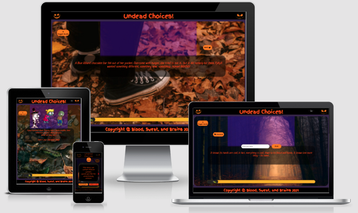

# Undead Choices

[Here is a link to the final project](https://abibubble.github.io/undead-choices/)

This project was created for the Code Institute Halloween Hackathon in October 2021. The theme for this was 'Spookathon', where we were tasked with creating an interactive Halloween book or story. It is designed to be responsive on a wide range of devices, whilst also being easy to navigate through.

## Contents

* [User Experience (UX)](#user-experience-(ux))
  * [Initial Discussion](#initial-discussion)
  * [User Stories](#user-stories)

* [Design](#design)
  * [Color Scheme](#color-scheme)
  * [Typography](#typography)
  * [Imagery](#imagery) 
  * [Wireframes](#wireframes)
  * [Features](#features)
  * [Audio](#audio)

* [Technologies Used](#technologies-used)
  * [Languages Used](#languages-used)
  * [Frameworks, Libraries & Programs Used](#frameworks-libraries-and-programs-used)

* [Deployment](#deployment)
  * [Initial Deployment](#initial-deployment)
  * [How to Fork it](#how-to-fork-it)
  * [How to Clone it](#how-to-clone-it)
  * [Making a Local Clone](#making-a-local-clone)

* [Testing](#testing)

* [Credits](#credits)
  * [Code](#code)
  * [Content](#content)
  * [Media](#media)
  * [Acknowledgements](#acknowledgements)

---

## User Experience (UX)

### Initial Discussion

This project was created for the Code Institute Halloween Hackathon in October 2021. The theme for this was 'Spookathon'. We were tasked with creating an interactive Halloween book or story. The brief stated that this project needs to depict a halloween story or fairy tale, it needs to be able to be interacted with in some way, and it should have animated elements. It is designed to be responsive on a wide range of devices, whilst also being easy to navigate through. We wanted this site to be accessible to users of all ages, and we wanted to be fully inclusive of gender choices.

### User Stories

#### Client Goals

* To depict a Halloween story or fairy tale.
* To be able to be interacted with in some way.
* To have animated elements.

#### First Time Visitor Goals

* Easy to understand what to do.
* Easy to navigate.
* Easy to follow storyline.
* Accessible for people of all ages.

#### Returning Visitor Goals

* Different endings to the story.
* Doesn't exclude people of any gender.

[Back to Top](#title)

---

## Design

### Color Scheme

* The following colors have been used:
  * Dark orange - #fe5404
  * Light orange - #ff8c00
  * Dark purple transparent - #6600ff55
  * Dark purple - #3e2a57
  * Yellow - #ffc106
  * Dark grey - #272727
  * Light grey - #faebd7
  * Black - #000000
  * White - #ffffff
* These colors have all been chosen to match the spooky, Halloween theme of this site.

### Typography

* The main fonts used are [Neucha](https://fonts.google.com/specimen/Neucha?query=Neucha) and [Finger Paint](https://fonts.google.com/specimen/Finger+Paint?query=finger+paint) from Google Fonts.
* These fonts have been used to link the story aspect with the Halloween theme.
* They are rough fonts, similar to clumpy handwriting, which match the zombie theme nicely.

### Imagery

* The background image is of a spooky forest at night, which sets the Halloween theming.
* The modal background image is of some carved pumpkins, to link with the Halloween theme.
* The characters are all zombies, to fit with the storyline.
* The image in the progress bar is a dismembered hand, to fill the entire site with spooky theming.
* The images at the end of the progress bar change depending on which ending the user gets.
* There are two black pumpkins in the top corners of the header, to link with the Halloween theme.

### Wireframes

The design for this site changed as we realised what was a realistic end product. These are the original wireframes:

* [Original wireframes for desktop for this project](assets/docs/wireframes-desktop.png).
* [Original wireframes for mobile for this project](assets/docs/wireframes-mobile.png).

Once we had changed the designs for the site, we re-made the wireframes for our new design ideas:

* [Wireframes after design change](assets/docs/wireframes.pdf).

### Features

* A progress bar to track the user's progress through the story.
* An animated page-turn.
* Animated character avatars.
* Story change depending on the age preference chosen.
* Multiple story endings.
* Background audio that changes depending on the section of story that the user is on.
* Sound effects that play when the user is reading the relevant page.

### Future Features

* Full sound effects linked to each page.
* Randomised spider animation for going up and down its web.
* Capital letter at the start of a sentence where the user's pronoun starts the sentence.
* Different ending page for each type of game over.

### Audio

* The following audio is used to set the scene at various parts of the story:
  * Bubbles audio for the bubbling potion.
  * Drinking audio for if the user chooses to drink the potion.
  * Large zombie horde.
  * Small zombie horde.
  * Splash audio for when the user looks into the puddle.
  * Windy trees audio to set the scene at the start of the story.
  * Zombie biting audio if the user chooses to feed from Brian.
  * Zombie hiss audio for zombie attacks.
  * Zombie moan audio for when zombies speak.
  * Page turning audio for when the user turns the page.
  * Child giggling audio for the child-friendly choice.
* Two different background audios have been used:
  * Gentle eerie audio, for the majority of the story.
  * Dramatic music for when the zombie horde arrives.

[Back to Top](#title)

---

## Technologies Used

### Languages Used

* [HTML5](https://developer.mozilla.org/en-US/docs/Web/Guide/HTML/HTML5)
* [CSS3](https://developer.mozilla.org/en-US/docs/Archive/CSS3#:~:text=CSS3%20is%20the%20latest%20evolution,flexible%20box%20or%20grid%20layouts.)
* [JavaScript](https://developer.mozilla.org/en-US/docs/Web/JavaScript)

### Frameworks Libraries and Programs Used

#### Font Awesome

[Font Awesome](https://fontawesome.com/) was used on all pages to add the instructions, home, settings and copyright icons.

#### Git

Git was used for version control by utilizing the Gitpod terminal to add and commit to Git and push to GitHub.

#### GitHub

GitHub is used to store the code for this project after being pushed from Git.

#### Balsamiq

Balsamiq was used to create the wireframes during the design process.

#### Responsinator

[Responsinator](http://www.responsinator.com/) was used to help improve the responsive design on a variety of devices.

#### Google DevTools

Google DevTools was used to help me find what code correlated to what feature.

#### Am I Responsive Design

[Am I Responsive Design](http://ami.responsivedesign.is/#) was used to check the responsive design of the quiz.

#### Shields.io

[Shields.io](https://shields.io/) was used to create the GitHub badges for this README.md file.

#### Autoprefixer CSS online

[Autoprefixer CSS online](https://autoprefixer.github.io/) was used to ensure all prefixes for browsers were included correctly.

#### EZGif

[EZGif](https://ezgif.com/maker) was used to create gifs of the characters.

#### Figma

[Figma](https://www.figma.com/) was used to create the very basic plotline diagram.

#### app.diagrams

[app.diagrams](https://app.diagrams.net/) was used to create the storyline flow chart.

#### DeepStory AI

[DeepStory AI](https://www.deepstory.ai/#!/) was used to help with creating the storyline.

#### Online Convert

[Online Convert](https://image.online-convert.com/convert-to-webp) was used to convert our images to webp format.

#### Compressor

[Compressor.io](https://compressor.io/) was used to compress our images.

[Back to Top](#title)

---

## Deployment

### Initial Deployment

This site was deployed to GitHub Pages by following these steps:

1. Login or Sign Up to [GitHub](www.github.com).
2. Create a new repository named "undead-choices".
3. Once created, click on "Settings" on the navigation bar under the repository title.
4. Scroll down to "GitHub Pages".
5. Under "Source", choose which branch to deploy. I chose "master", but this is sometimes shown as "main".
6. Choose which folder to deploy from, usually "/root".
7. Click "Save", then wait for it to be deployed. It can take some time for the page to be fully deployed.
8. Your URL will be displayed above "Source".

### How to Fork it

1. Login or Sign Up to [GitHub](www.github.com).
2. On GitHub, go to [Abibubble/undead-choices](https://github.com/Abibubble/undead-choices).
3. In the top right, click "Fork".

### How to Clone it

1. Login or Sign Up to [GitHub](www.github.com).
2. Fork the repository Abibubble/undead-choices using the steps above in [How to Fork it](#how-to-fork-it).
3. Above the file list, click "Code".
4. Choose if you want to clone using HTTPS, SSH, or GitHub CLI, then click the copy button to the right.
5. Open Git Bash.
6. Change the directory to where you want your clone to go.
7. Type git clone and then paste the URL you copied in step 4.
8. Press Enter to create your clone.

### Making a Local Clone

1. Log in to [GitHub](www.github.com) and locate the [Repository](https://github.com/Abibubble/undead-choices) for this site.
2. Under the repository name, above the list of files, click "Code".
3. Here you can either Clone or Download the repository.
4. You should clone the repository using HTTPS, clicking on the icon to copy the link.
5. Open Git Bash.
6. Change the current working directory to the new location, where you want the cloned directory to be.
7. Type git clone, and then paste the URL that was copied in Step 4.
8. Press Enter, and your local clone will be created.

For a more detailed version of these steps, go to the [Github Docs](https://docs.github.com/en/github/creating-cloning-and-archiving-repositories/cloning-a-repository#cloning-a-repository-to-github-desktop) page on this topic.

[Back to Top](#title)

---

## Testing

[Click here to view the full testing steps completed on this project](TESTING.md).

[Back to Top](#undead-choices)

---

## Credits

[Click here to view the full credits for this site](CREDITS.md)

### Acknowledgements

* Our facilitator, Jim Morel, at [Code Institute](https://codeinstitute.net/), for his helpful feedback and support.
* The team at [Code Institute](https://codeinstitute.net/), for teaching us the necessary skills to create this site.
* All team members of team Blood, Sweat, and Brains:
  * [Abi Harrison](https://github.com/Abibubble)
  * [Alexander Grib](https://github.com/alexandergrib)
  * [Dave Horrocks](https://github.com/DaveyJH)
  * [Django Heimgartner](https://github.com/D1ang)

[Back to Top](#undead-choices)
