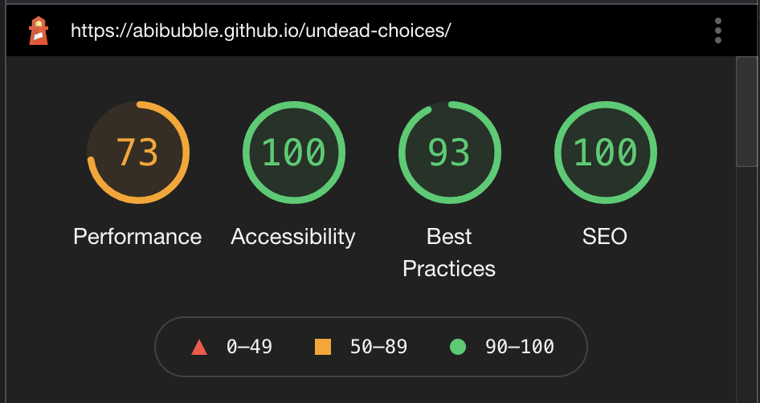
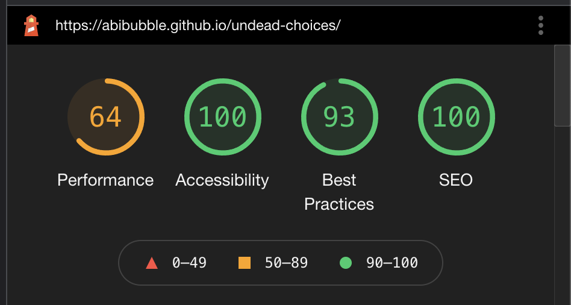

# Testing

## Contents

* [Devices and Browsers](#devices-and-browsers)

* [Links and Navigation](#links-and-navigation)
  * [Home page](#home-page)
  * [404 page](#404-page)
  * [Outro page](#outro-page)
  * [Modals](#modals)

* [Styling and Layout](#styling-and-layout)

* [Functions](#functions)
  * [Main Home Page](#main-home-page)
  * [Modals Functionality](#modals-functionality)
  * [Animation](#animation)
  * [Audio](#audio)

* [Validation](#validation)

* [Testing User Stories](#testing-user-stories)
  * [Client Goals](#client-goals)
  * [First Time Visitor Goals](#first-time-visitor)
  * [Returning Visitor Goals](#returning-visitor-goals)

* [Bugs](#bugs)
  * [Solved Bugs](#solved-bugs)
  * [Known Bugs](#known-bugs)

* [Lighthouse](#lighthouse)
  * [Mobile](#mobile)
  * [Desktop](#desktop)
  * [Performance](#performance)
  * [Best PRactices](#best-practices)
  * [Accessibility](#accessibility)
  * [SEO](#seo)

* [Responsive Design](#responsive-design)
  * [Mobile Responsive Design](#mobile-responsive-design)
  * [Tablet Responsive Design](#tablet-responsive-design)
  * [Computer Responsive Design](#computer-responsive-design)

[Back to Top](#testing)

---

## Devices and Browsers

### Desktop / Laptop

1. Google Chrome
    * All tested and working correctly.

2. Microsoft Edge
    * All tested and working correctly.

3. Mozilla Firefox
    * All tested and working correctly.

4. Safari
    * All tested and working correctly.

### Tablet

1. Safari
    * All tested and working correctly.

### Mobile

1. Google Chrome
    * All tested and working correctly.

2. Safari
    * All tested and working correctly.

3. Samsung Internet
    * All tested and working correctly.

### Full devices and browsers

* The website was tested on Google Chrome, Mozilla Firefox, Microsoft Edge, Safari and Samsung Internet browsers.
* Testing was not done on Internet Explorer due to it being depreciated in favour of Microsoft Edge.
* The website was viewed on a variety of devices, including:
  * Custom built desktop PC, running Windows 10
  * Acer Aspire V Nitro Laptop, running Windows 10
  * Lenovo B51 IntelCore i7 Laptop, running Ubuntu 16.04 LTS
  * MacBook Air7,2 (13-inch, 2017)
  * MacBook Pro (15-inch, 2017), running macOS Catalina
  * iPad 6,11 5th generation, running iOS 10.3
  * iPhone 7
  * iPhone X
  * iPhone 12
  * OPPO Find X2 Lite
  * OPPO Find X2
  * Samsung Galaxy A70
  * Samsung Galaxy S9
  * Samsung A20
  * xBox One

A large amount of testing was done to ensure that all pages were displayed, and all functionality worked as it should. Friends, family members, and other developers were asked to review the site and documentation to point out any bugs and/or user experience issues that they came across.

On every device and browser listed above, I tested the following:

## Links and Navigation

### Home Page

* Enter the user's name to populate the story with the user's name.
* Click the male adult or child avatar to populate the story with male pronouns.
* Click the female adult or child avatar to populate the story with female pronouns.
* Click the candy avatar to populate the story with genderless pronouns.
* Click the 'Next' button to take the user to the next paragraph of the story.
* Click the 'Next Page' button to take the user to the next page of the story.
* Click the 'Previous' button to take the user to the previous paragraph of the story.
* Click the 'East' button to select the East path of the story.
* Click the 'West' button to select the West path of the story.
* Click the 'Feed' button to select the Feed path of the story.
* Click the 'Don't Feed' button to select the Don't Feed path of the story.
* Click the 'Consume' button to select the Consume path of the story.
* Click the 'Collect' button to select the Collect path of the story.
* Click the 'Continue' button to select the Continue path of the story.
* Click the 'Flee' button to select the Flee path of the story.
* Click the 'Help' button to select the Help path of the story.
* Click the 'Don't Help' button to select the Don't Help path of the story.
* Click the 'Red potion' button to select the Red potion path of the story.
* Click the 'Purple potion' button to select the Purple potion path of the story.
* Click the 'Blue potion' button to select the Blue potion path of the story.
* Get a death ending, and the gravestone icon appears at the end of the progress bar.
* Get a cure ending, and the potion icon appears at the end of the progress bar.
* Get a love ending, and the heart icon appears at the end of the progress bar.
* As the user reaches the end of a page, the progress bar updates.
* The severed hand gif moves with the end of the progress bar.
* The audio button toggles the audio on if the audio is off.
* The audio button toggles the audio off if the audio is on.

### 404 Page

* This page will display if a user has tried to access a page that doesn't exist.
* It states clearly that it's a 404 error, and that the page hasn't been found.
* It directs the user back to the safety of the site.
* It is styled to match the rest of the site.

### Outro Page

* This page will display when the user reaches an ending to the story.
* It displays the developers in the team that made this project.
* It directs the user back to the home page to start again.
* It is styled to match the rest of the site.
* Click the Jim character to go to Jim's GitHub profile.
* Click the Abi character to go to Abi's GitHub profile.
* Click the Alex character to go to Alex's GitHub profile.
* Click the Dave character to go to Dave's GitHub profile.
* Click the Djang character to go to Djang's GitHub profile.

### Modals

* The Age Control modal appears when the page first loads.
* The Age Control modal appears when the user returns to the main page from the 404 page.
* The Age Control modal appears when the user returns to the main page from the Outro page.
* Click the 'Child-friendly, please!' button on the Age Control modal to load a child-friendly version of the story, and child avatars.
* Click the 'Psshhh, I'm the bravest around!' button on the Age Control modal to load a non-child-friendly version of the story, and adult avatars.
* The Brian modal appears when the user enters their name as 'Brian'.
* The Brian modal appears when the user enters their name as 'brian'.
* Click the 'A game? Yes please!' button to take the user to Icecapades game in a new tab.
* Click the 'No thanks, I like zombies!' button to close the modal.

[Back to Top](#testing)

---

## Styling and Layout

* Ensure all images load correctly.
* Ensure all gifs load correctly.
* Ensure all animations load correctly.
* Ensure all grid layouts size correctly on all screen sizes.
* Ensure all modals appear in front of all other content on the screen.

[Back to Top](#testing)

---

## Functions

### Modals Functionality

* The Age Control modal is visible in front of all other items on the screen, and clearly displays the Cancel and Delete buttons.
* The Brian modal is visible in front of all other items on the screen, and clearly displays the Cancel and Delete buttons.

### Main home page

* The main story is displayed on this page.
* The user's choices changes the page depending on what choice they've made.

### Animation

* The male adult character toggles to jump state when the user hovers or focuses on it.
* The male adult character walks off the screen if it isn't chosen by the user.
* The female adult character toggles to jump state when the user hovers or focuses on it.
* The female adult character walks off the screen if it isn't chosen by the user.
* The male child character toggles to jump state when the user hovers or focuses on it.
* The male child character walks off the screen if it isn't chosen by the user.
* The female child character toggles to jump state when the user hovers or focuses on it.
* The female child character walks off the screen if it isn't chosen by the user.
* The candy character toggles to jump state when the user hovers or focuses on it.
* The little spider drops down the screen on a web when the user selects an avatar.
* The little spider web disappears after the spider has dropped.
* The page turn animation happens when the user moves to the next page.
* The page turn animation doesn't happen when the user moves to the next paragraph.

### Audio

* The audio button toggles the audio on if the audio is off.
* The audio button toggles the audio off if the audio is on.
* Background audio plays throughout the story, if the audio is turned on.
* Zombie bite plays when a bite happens in the story, if the audio is turned on.
* Drink plays when a drink happens in the story, if the audio is turned on.
* Puddle plays when the user chooses a character, if the audio is turned on.
* Baby giggle plays when the user chooses the child-friendly option on the Age Control modal, if the audio is turned on.

[Back to Top](#testing)

---

## Validation

### W3C Validator

The W3C Markup Validator, W3C CSS Validator and JSHint were used to validate the project to ensure there were no syntax errors within the site.

1. W3C Markup Validator
    * [HTML Results](https://validator.w3.org/nu/?doc=https%3A%2F%2Fabibubble.github.io%2Fundead-choices%2F)
    * [Outro page](https://validator.w3.org/nu/?doc=https%3A%2F%2Fabibubble.github.io%2Fundead-choices%2Foutro.html)
    * [404 page](https://validator.w3.org/nu/?doc=https%3A%2F%2Fabibubble.github.io%2Fundead-choices%2F404.html)

2. W3C CSS Validator
    * [Index page](https://jigsaw.w3.org/css-validator/validator?uri=https%3A%2F%2Fabibubble.github.io%2Fundead-choices%2F&profile=css3svg&usermedium=all&warning=1&vextwarning=&lang=en)
    * [Outro page](https://jigsaw.w3.org/css-validator/validator?uri=https%3A%2F%2Fabibubble.github.io%2Fundead-choices%2Foutro.html&profile=css3svg&usermedium=all&warning=1&vextwarning=&lang=en)
    * [404 page](https://jigsaw.w3.org/css-validator/validator?uri=https%3A%2F%2Fabibubble.github.io%2Fundead-choices%2F404.html&profile=css3svg&usermedium=all&warning=1&vextwarning=&lang=en)

3. JSHint Extension
    * [JSHint Extension](https://marketplace.visualstudio.com/items?itemName=dbaeumer.jshint)
    * The JSHint Extension for VSCode was used to validate the JavaScript in this project.
    * No validation errors were found.

[Back to Top](#testing)

## Testing User Stories

### Client Goals

#### To depict a Halloween story or fairy tale

* This site features a Halloween story written by our team (with some help from [an AI writing bot](https://www.deepstory.ai/#!/)).
* The story is of a zombie discovering they're a zombie, and searching for a cure for the Zombie King.

#### To be able to be interacted with in some way

* The entire story is a choose your own adventure.
* Every page turn requires the user interacting with the site.
* When the user makes a choice, their storyline is adjusted based on the choices they make.

#### To have animated elements

* The user avatars are fully animated.
* The progress bar includes an animated hand.
* There is a little animated spider that drops down when the user makes certain choices.

### First Time Visitor Goals

#### Easy to understand what to do

* The instructions are very clear at every step of the way.
* The story tells the user what they need to do.
* The story gives the user options for deciding which direction they want to take the story in.

#### Easy to navigate

* The story tells the user what they need to do.
* The story gives the user options for deciding which direction they want to take the story in.

#### Easy to follow storyline

* The storyline is fairly simple, and is broken up into small chunks for ease of reading.
* There is also a back button, so if the user wishes to go back and re-read a page, they can do.

#### Accessible for people of all ages

* There is a child-friendly option in the storyline.
* There is also a more adult version of the storyline, with more descriptive text.

### Returning Visitor Goals

#### Different endings to the story

* There are multiple endings to the story.
* Multiple endings increases re-playability, as the user will be more likely to come back to play to the other endings.

#### Doesn't exclude people of any gender

* There are multiple avatar options to choose from.
* The user can choose from one of the following options:
  * An adult male-looking zombie.
  * An adult female-looking zombie.
  * A child male-looking zombie.
  * A child female-looking zombie.
  * A genderless zombie character.
* The user is never asked for their gender.
* The user can choose the avatar that they identify closest with.

[Back to Top](#testing)

## Bugs

### Solved Bugs

1. [The responsive pumpkin border](https://www.youtube.com/watch?v=vnODfFJTLGg) caused us issues on all browsers except for Google Chrome.
    * We checked on [Can I Use](https://caniuse.com/) and didn't see any issues with the border-image property not being supported.
    * We tried prefixing the border-image properties with `-webkit-` and `-moz` but that didn't help.
    * In the end, we removed the border, and instead used the pumpkin images as accents on the header.

### Known Bugs

* The pronoun updates aren't working for the age inserts currently.
* The spider comes down the web, but doesn't go back up.

## Lighthouse

We tested our website using DevTools Lighthouse feature, and got these results:

### Desktop Lighthouse

### Mobile Lighthouse

### Performance

* Unfortunately we weren't as happy with this score.
* We lost a lot of points here because the site is incredibly image-heavy.
* We have also used gifs for animated content, which Lighthouse usually recommends to display as videos.
* This wasn't an option for us, due to how we wanted to use the gifs.

### Accessibility

* We were happy with this score.
* We ensured to include accessibility as a top priority whilst developing this site.

### Best Practices

* We were happy with this score.
* The only thing causing us to lose points here was the severed hand gif, which we have rendered slightly squashed. However, this was a design choice, as we wanted the hand to look like it was being pressed in my the top and bottom of the progress bar.

### SEO

* We were happy with this score.
* We ensured to have all relevant meta tags in place for best SEO.

[Back to Top](#testing)

--

## Responsive Design

### Mobile Responsive Design

* The Home page looks good and nothing wraps where it shouldn't or disappears off the edge of the viewport.
* The Outro page looks good and nothing wraps where it shouldn't or disappears off the edge of the viewport.
* The 404 page looks good and nothing wraps where it shouldn't or disappears off the edge of the viewport.
* The Age Control modal looks good, is placed in front of all other content, and nothing wraps where it shouldn't or disappears off the edge of the viewport.
* The Brian modal looks good, is placed in front of all other content, and nothing wraps where it shouldn't or disappears off the edge of the viewport.
* The buttons have well sized text, not so big it takes up too much screen space, and not so small that they're difficult to read.
* All the font sizes aren't too big or too small for the screen size.
* All fonts are easy to read.
* All images are scaled to the screen size, whilst maintaining the correct aspect ratio.
* All animated characters are scaled to the screen size, whilst maintaining the correct aspect ratio.
* The progress bar is scaled to the screen size, whilst maintaining the correct aspect ratio.

### Tablet Responsive Design

* The Home page looks good and nothing wraps where it shouldn't or disappears off the edge of the viewport.
* The Outro page looks good and nothing wraps where it shouldn't or disappears off the edge of the viewport.
* The 404 page looks good and nothing wraps where it shouldn't or disappears off the edge of the viewport.
* The Age Control modal looks good, is placed in front of all other content, and nothing wraps where it shouldn't or disappears off the edge of the viewport.
* The Brian modal looks good, is placed in front of all other content, and nothing wraps where it shouldn't or disappears off the edge of the viewport.
* The buttons have well sized text, not so big it takes up too much screen space, and not so small that they're difficult to read.
* All the font sizes aren't too big or too small for the screen size.
* All fonts are easy to read.
* All images are scaled to the screen size, whilst maintaining the correct aspect ratio.
* All animated characters are scaled to the screen size, whilst maintaining the correct aspect ratio.
* The progress bar is scaled to the screen size, whilst maintaining the correct aspect ratio.

### Computer Responsive Design

* The Home page looks good and nothing wraps where it shouldn't or disappears off the edge of the viewport.
* The Outro page looks good and nothing wraps where it shouldn't or disappears off the edge of the viewport.
* The 404 page looks good and nothing wraps where it shouldn't or disappears off the edge of the viewport.
* The Age Control modal looks good, is placed in front of all other content, and nothing wraps where it shouldn't or disappears off the edge of the viewport.
* The Brian modal looks good, is placed in front of all other content, and nothing wraps where it shouldn't or disappears off the edge of the viewport.
* The buttons have well sized text, not so big it takes up too much screen space, and not so small that they're difficult to read.
* All the font sizes aren't too big or too small for the screen size.
* All fonts are easy to read.
* All images are scaled to the screen size, whilst maintaining the correct aspect ratio.
* All animated characters are scaled to the screen size, whilst maintaining the correct aspect ratio.
* The progress bar is scaled to the screen size, whilst maintaining the correct aspect ratio.

[Back to Top](#testing)
